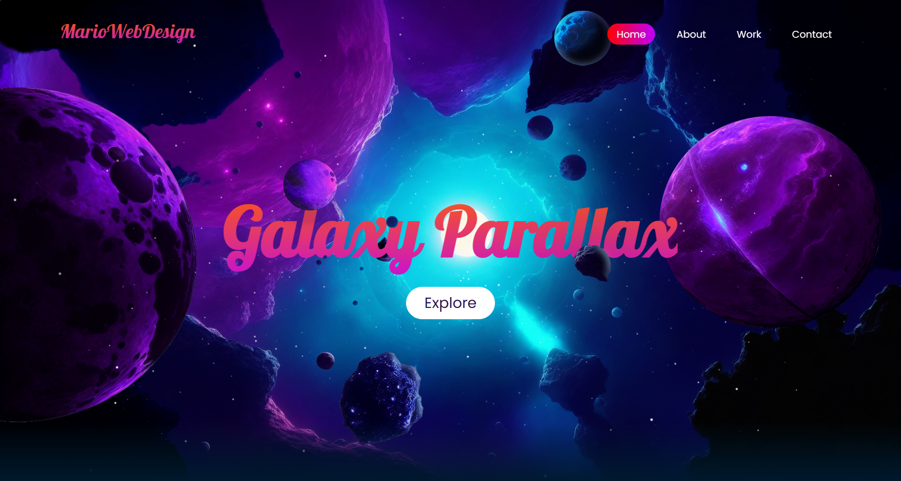

 

# Galaxy Parallax

Este proyecto es una página web interactiva que utiliza HTML, CSS y JavaScript para crear un efecto de paralaje de galaxia.

## Características

- Efecto de paralaje de galaxia al desplazarse por la página.
- Utiliza solo HTML, CSS y JavaScript, sin dependencias externas.
- Efectos de estrellas realizado con JavaScript.

## Uso

1. Clona este repositorio en tu máquina local.
2. Abre el archivo `index.html` en tu navegador web.
3. ¡Disfruta del efecto de paralaje de galaxia!

## Estrellas

Puedes encontrar más información sobre las estrellas en [Starts](https://github.com/Marioalf2002/starts).
